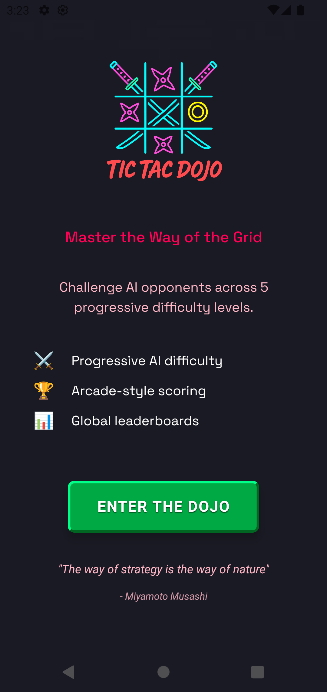
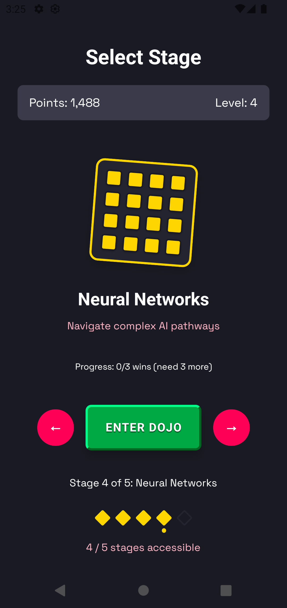

# Tic-Tac-Dojo 🥋

<p align="center">
  
</p>

<p align="center">
  <strong>Master the art of Tic-Tac-Toe through progressive AI challenges</strong>
</p>

## Overview

Tic-Tac-Dojo is a React Native mobile game that transforms the classic game of Tic-Tac-Toe into a progressive martial arts journey. Players advance through increasingly challenging AI opponents, each representing a different level of mastery in the ancient art of X's and O's.

## Try It Now! 🎮

<p align="center">
  <strong>Play Tic-Tac-Dojo directly in your browser:</strong>
</p>

<p align="center">
  <a href="https://appetize.io/app/b_bnaba5gob6yfe4mo2jkb2kdjvi" target="_blank">
    
  </a>
</p>

## Screenshots

<p align="center">
  
  
  
</p>

<p align="center">
  
  
  
</p>

## How It Works

### 🎮 Game Flow

1. **Start Your Journey**: Launch the app and enter the dojo
2. **Select Your Stage**: Progress through 5 difficulty levels
3. **Battle the AI**: Make your moves on a 3x3 (or 4x4 for advanced levels) grid
4. **Strategic Gameplay**: Each AI opponent has unique behaviors and strategies
5. **Level Up**: Win matches to unlock new challenges and face stronger opponents

### 🤖 AI Progression System

The game features 5 distinct AI personalities with increasing difficulty:

- **Level 1 - Novice** (30% optimal play): Learn the basics against a beginner AI
- **Level 2 - Apprentice** (50% optimal play): Face an AI with pattern recognition
- **Level 3 - Warrior** (55-70% adaptive): Battle an adaptive AI that learns from defeats
- **Level 4 - Master** (60-70% adaptive): Challenge yourself on a 4x4 grid
- **Level 5 - Grandmaster** (95% optimal play): Face near-perfect AI with advanced strategies

### 🏆 Key Features

- **Progressive Difficulty**: AI opponents that adapt and become stronger
- **Timed Challenges**: Move and game time limits add pressure
- **Scoring System**: Comprehensive scoring that rewards strategic play
- **Anti-Cheat Protection**: Server-side validation ensures fair play
- **Beautiful Animations**: Smooth, responsive UI with delightful interactions
- **Leaderboard**: Compete globally and track your ranking

## Tech Stack

### Mobile App
- **React Native** with Expo
- **TypeScript** for type safety
- **Tamagui** for UI components
- **Reanimated** for smooth animations
- **i18n** for internationalization

### Backend API
- **Vercel** serverless functions
- **Firebase Firestore** for data persistence
- **Auth0** for authentication
- **Advanced AI algorithms** for opponent behavior
- **Rate limiting** and security measures

## Architecture

```
tic-tac-dojo/
├── mobile/           # React Native app
├── api/             # Vercel serverless functions
├── admin/           # Admin dashboard
└── public/          # Static assets
```

## Getting Started

The game is deployed and ready to play! The backend API is hosted on Vercel and the mobile app can be built for iOS, Android, and Web platforms.

### API Base URL
```
https://tic-tac-dojo.vercel.app
```

### Running the Web Version

The app includes React Native Web support! To run it as a web app:

```bash
# Navigate to the mobile directory
cd mobile

# Install dependencies
npm install

# Start the web development server
npm run web

# Build for production
npm run bundle:web

# Serve the production build locally
npm run serve:web
```

The web version uses:
- localStorage instead of react-native-mmkv for data persistence
- Web-compatible versions of native modules
- Same React Native codebase with platform-specific adaptations

### Deployment Options

You can deploy the web build to:
- **Vercel**: Deploy the `mobile/dist` folder after running `npm run bundle:web`
- **Netlify**: Similar to Vercel, deploy the `dist` folder
- **GitHub Pages**: Push the built files to a gh-pages branch
- **Any static hosting**: The web build is a standard static site

## Game Mechanics

- **Grid Sizes**: 3x3 for levels 1-3, 4x4 for advanced levels
- **Turn-based**: Player always plays as 'X' and moves first
- **Win Conditions**: Standard tic-tac-toe rules (3 or 4 in a row)
- **Time Limits**: Both per-move and total game time constraints
- **Scoring**: Points based on speed, moves, and strategic play

## Security Features

- Server-side winner determination
- Move validation and anti-cheat detection
- Rate limiting on API endpoints
- Temporal validation for game timing
- Input sanitization

---

<p align="center">
  Made with ❤️ for strategy game enthusiasts
</p>
</contents>
</invoke>
